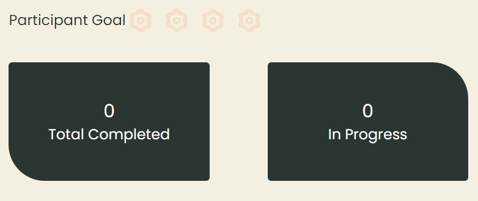

# Welcome To Hacktoberfest 2021

## [View website](https://aniket328.github.io/hacktober_website/)
 ☝️ ☝️ ☝️ ☝️
General Information Website for hackoctober-fest

ADD CONTENTS HERE IN "README.MD" ABOUT HACKTOBER FEST, TO ADD IT TO THE WEBSITE

### About Hacktober
2013 marks the begining of this amazing fest wherein all the open source enthusiasts are welcomed.
As the name suggests its a month long celebration for Oct 1 to Oct 31 every year.

## Aim 
Facilitated by DigitalOcean , it  intends to urge contributors to add to open-source ventures , help each other to grow and reward the local area.

## What's there for you!!!!
Whether you are a  complete novice in the field of open source , or an experienced one.
There's something in store for everyone.
They say if you want to go fast go alone, if you want to go far walk together.

 - Prepare and share your project for collaboration
 - Contribute to the betterment of a project via pull requests
 - Organize an event
 - Mentor others
 - Donate directly to open source projects

## Perks
Perks of participating in hacktoberfest

- Hacktoberfest engages members to venture outside of their usual range of familiarity, convey individual ability, gain knowledge of arising advances, learn and work on close to home responsibility, and add to working on the world. 

- It urges you to chip away at different undertakings and gain your insight and expirience in this. 

- You can develop your organizations through this stage which will help you in future. 

- Hacktober Fest gives you a recognization over others ,which assists you with developing your vocation. 

- It rouses you to put forth a valiant effort and empower you while give invigorating treats like shirts / establishing plants of your name on finishing 4 ventures.

### Hacktober Rules 
 - Pull requests can be made in any participating GitHub or GitLab hosted repository/projects. Look for the '**hacktoberfest**' topic to know if a project is participating in Hacktoberfest
 - You can sign up **anytime between October 1 and October 31**. Just be sure to sign up on the official [Hacktoberfest website](https://hacktoberfest.digitalocean.com/) for your pull requests to count.
 - The pull request must contain commits you made yourself.
 - If a maintainer reports your pull request as **spam**, it will not be counted toward your participation in Hacktoberfest.
 - If a maintainer reports behavior that’s not in line with the project’s code of conduct, you will be **ineligible** to participate.
 - A pull request is considered approved once it has an overall approving review from maintainers, or has been merged by maintainers, or has been given the '**hacktoberfest-accepted**' label.

  
 
### Word of Caution
- Spammy pull requests can be labeled as “**spam**” or "**invalid**." Pull requests with a label containing either of these words won't count toward Hacktoberfest.
- Pull requests must be approved by a maintainer. PRs can be accepted either by being merged, having an overall approving review, or having the ‘**hacktoberfest-accepted**’ label.After a PR is approved it enters a fourteen-day review window where hacktober team does some more checking in accordance with **Hacktober Rules**.After the fourteen-day window has passed, the PR becomes eligible for Hacktoberfest and this cannot be reversed.
- Bad repositories will be excluded.Many repositories encourage participants to make simple pull requests – to quickly gain a pull request towards winning. While these projects may be a valuable learning tool for new contributors, they often aren't valuable and high quality contributions to open source projects, and go against the fest's core values.

## Good Luck and Warm Welcome to All
A warm welcome and lots of good wishes on becoming part of our growing team. Congratulations to all participants in Hacktoberfest. 
We are all happy and excited about your inputs and contribution to Hacktoberfest.

